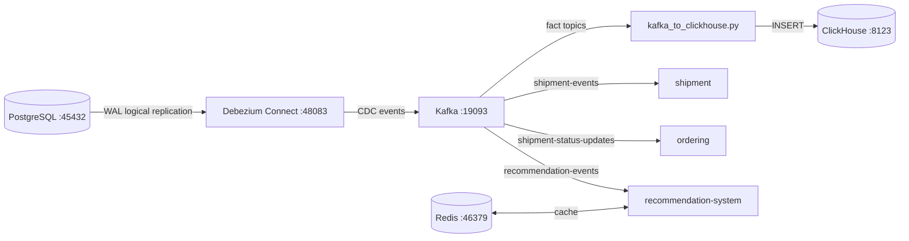
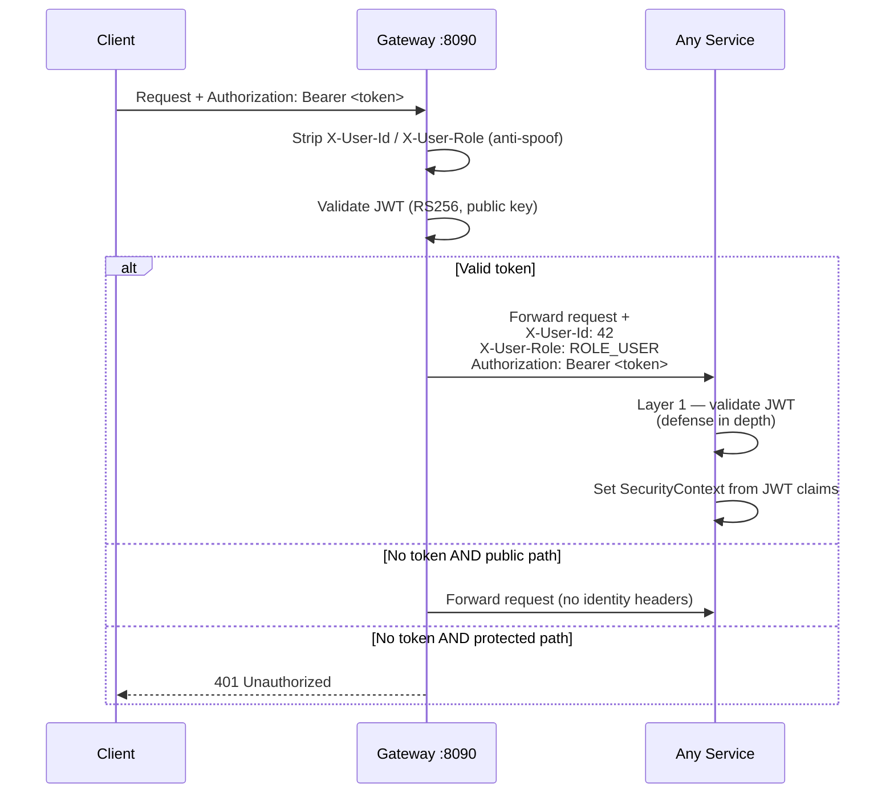
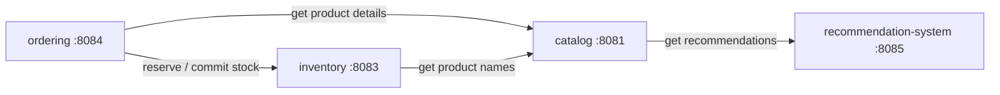
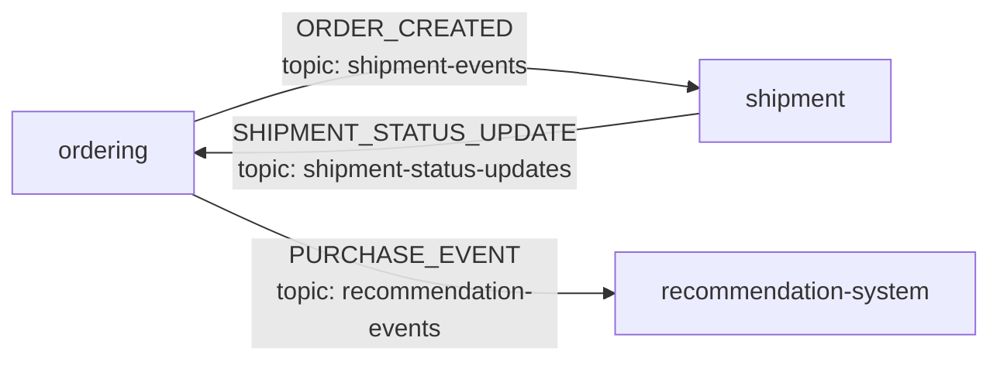
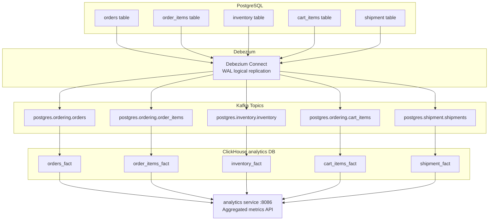

# E-Shop — Microservices Platform (WIP)

A full-stack e-commerce platform built as a **diploma project** to demonstrate a production-style microservices architecture. It combines synchronous REST, event-driven messaging (Kafka), Change Data Capture (Debezium → ClickHouse), a hybrid recommendation engine, and a centralised API Gateway with two-layer JWT authentication.

---

## Table of Contents

1. [Architecture Overview](#1-architecture-overview)
2. [Services & Ports](#2-services--ports)
3. [Infrastructure](#3-infrastructure)
4. [Authentication & Security](#4-authentication--security)
5. [Service Communication](#5-service-communication)
6. [Analytics Pipeline (CDC)](#6-analytics-pipeline-cdc)
7. [Recommendation System](#7-recommendation-system)
8. [API Reference](#8-api-reference)
9. [Getting Started](#9-getting-started)
10. [Project Conventions](#10-project-conventions)

---

## 1. Architecture Overview

```
┌──────────────────────────────────────────────────────────────────┐
│                        BROWSER / CLIENT                          │
│                     React 18 + Vite  :5173                       │
└───────────────────────────┬──────────────────────────────────────┘
                            │  All API calls → :8090
                            ▼
┌──────────────────────────────────────────────────────────────────┐
│                      API GATEWAY  :8090                          │
│          Spring Cloud Gateway (WebFlux / reactive)               │
│                                                                  │
│  • Single CORS authority                                         │
│  • JWT validation  (JwtAuthenticationGlobalFilter)               │
│  • Injects X-User-Id / X-User-Role headers                       │
│  • Routes by path prefix — no rewriting                          │
└──┬──────┬──────┬──────┬──────┬──────┬───────────────────────────┘
   │      │      │      │      │      │
   ▼      ▼      ▼      ▼      ▼      ▼
 user  catalog  ship  invent order  analytics
 :8080  :8081  :8082  :8083  :8084   :8086
   │      │              │      │
   │      │    Feign      │      │
   │      └──────────────►│      │
   │      └────────────────────►recommendation
   │                      └─────►  :8085 (Python/FastAPI)
   │
   └──── Kafka ────► shipment, ordering, recommendation-system
```

### Key architectural decisions

| Decision | Choice | Why |
|---|---|---|
| API entry point | Single gateway | One place for CORS, auth, and routing |
| Auth boundary | Gateway + service fallback | Defense in depth without full service-mesh overhead |
| Sync communication | OpenFeign | Simple, typed HTTP clients between services |
| Async communication | Kafka | Decoupled order→shipment and purchase→recommendations |
| Analytics store | ClickHouse | Columnar storage, fast aggregations for dashboards |
| Change capture | Debezium (WAL) | Zero-impact CDC — reads PostgreSQL WAL, no polling |
| Migrations | Liquibase | Schema-as-code; Hibernate only validates |

---

## 2. Services & Ports

| Service | Language / Framework | Port | Database | Notes |
|---|---|---|---|---|
| `gateway` | Java 17 / Spring Cloud Gateway | **8090** | — | Reactive (WebFlux). Never add `spring-boot-starter-web` here |
| `user` | Java 17 / Spring Boot | **8080** | PostgreSQL `user_service` | Issues RS256 JWTs; owns private key |
| `catalog` | Java 17 / Spring Boot | **8081** | PostgreSQL `catalog` | Products, search, recommendations |
| `shipment` | Kotlin / Spring Boot | **8082** | PostgreSQL `shipment` | Consumes order events from Kafka |
| `inventory` | Java 17 / Spring Boot | **8083** | PostgreSQL `inventory` | Stock reservation / commit pattern |
| `ordering` | Kotlin / Spring Boot | **8084** | PostgreSQL `ordering` | Orders + cart; orchestrates inventory |
| `recommendation-system` | Python / FastAPI | **8085** | PostgreSQL `recommendations` | Hybrid TF-IDF + SVD; Redis cache |
| `analytics` | Java 17 / Spring Boot | **8086** | ClickHouse | Reads aggregated facts; no PostgreSQL |

---

## 3. Infrastructure

All infrastructure runs in Docker via `infra/docker-compose.yml`.

| Component | Port | Purpose |
|---|---|---|
| PostgreSQL 14 | **45432** | Shared DB host for all services (separate databases per service) |
| Kafka (Bitnami) | **19093** (external) | Message broker for async events |
| Zookeeper | 12181 | Kafka coordination |
| Kafka UI | **17080** | Browse topics, consumers, messages |
| Debezium Connect | **48083** | CDC connector — captures WAL changes → Kafka topics |
| ClickHouse | **8123** (HTTP) / **9000** (native) | Analytics fact store |
| Redis | **46379** | Recommendation cache (TTL: 1 hour) |



### Starting infrastructure

```bash
# 1. Start all infra containers
docker-compose -f infra/docker-compose.yml up -d

# 2. Wait for Debezium to be healthy, then register CDC connectors
bash infra/setup-cdc.sh
```

---

## 4. Authentication & Security

### Overview

Authentication is **centralised in the gateway** with a **per-service fallback** for defense in depth.



### Two-layer filter in every service

Each service runs a single `JwtAuthenticationFilter` that handles both auth paths:

```
Request arrives at service
        │
        ├─ JWT present?
        │   ├─ YES → validate locally (RSA verify, no DB hit)
        │   │         ✓ valid   → auth from JWT claims       ← LAYER 1 (direct access)
        │   │         ✗ invalid → no auth; Spring Security rejects
        │   │                     (never falls back to headers on bad token)
        │   └─ NO  → trust X-User-Id / X-User-Role headers  ← LAYER 2 (normal gateway path)
        │             gateway already validated and injected them
        │
        └─ Spring Security enforces endpoint authorization rules
```

**Why both layers?**

| Scenario | What protects it |
|---|---|
| Normal request through gateway | Gateway validates JWT; injects headers; service uses Layer 2 |
| Direct service access with valid JWT | Layer 1 (service re-validates JWT) |
| Direct service access with forged headers only | Layer 1 catches it (no JWT → Spring Security rejects protected endpoints) |
| Direct service access with no credentials | Spring Security rejects |

> **Note:** The remaining gap is direct access with *no JWT* **and** forged headers. This is addressed in production by network isolation (Kubernetes `NetworkPolicy`, private subnet). Without it, Layer 2 can be spoofed by an internal caller.

### JWT structure

Tokens are RS256-signed and contain:

```json
{
  "sub": "user@example.com",
  "userId": 42,
  "roles": ["ROLE_USER"],
  "iat": 1716800000,
  "exp": 1716803600
}
```

- **Private key** lives only in `user` service (`private.pem`)
- **Public key** (`public.pem`) is distributed to every service and the gateway for signature verification

### Public paths (no JWT required)

Defined once in `JwtAuthenticationGlobalFilter`:

| Method | Path | Reason |
|---|---|---|
| `POST` | `/users` | Sign-up |
| `POST` | `/users/login` | Login |
| `POST` | `/users/logout` | Logout |
| non-POST | `/products/**` | Catalog browsing |
| `OPTIONS` | `/**` | CORS preflight |

---

## 5. Service Communication

### Synchronous (Feign clients)



Each Feign client attaches the current user's JWT via `FeignClientInterceptor` so downstream services see a properly authenticated request.

### Asynchronous (Kafka)



| Topic | Producer | Consumer | Payload |
|---|---|---|---|
| `shipment-events` | ordering | shipment | Order details triggering shipment creation |
| `shipment-status-updates` | shipment | ordering | Status updates (SHIPPED, DELIVERED…) |
| `recommendation-events` | ordering | recommendation-system | Purchase data for model retraining |

---

## 6. Analytics Pipeline (CDC)

The analytics pipeline captures data changes without modifying application code.



**How it works:**

1. PostgreSQL is configured with `wal_level=logical` (set in `docker-compose.yml`)
2. Debezium reads the Write-Ahead Log — zero impact on the OLTP databases
3. `infra/connectors/kafka_to_clickhouse.py` consumes the CDC topics and upserts into ClickHouse fact tables
4. The `analytics` service queries ClickHouse and exposes aggregated metrics to the frontend dashboard

**Register CDC connectors** (after Debezium is up):
```bash
bash infra/setup-cdc.sh
```

---

## 7. Recommendation System

A hybrid engine combining content-based and collaborative filtering.

```mermaid
graph TB
    subgraph recommendation-system :8085
        CB[Content-Based Filter\nTF-IDF on name/category/description\n+ cosine similarity]
        CF2[Collaborative Filter\nTruncatedSVD on user-item matrix\nAPScheduler periodic retraining]
        HYBRID[Hybrid combiner]
        REDIS[(Redis cache\nTTL: 1 hour\nkey: recs:user:{userId})]
    end

    REQ[GET /products/recommendations] --> REDIS
    REDIS -->|cache miss| HYBRID
    CB --> HYBRID
    CF2 --> HYBRID
    HYBRID --> REDIS
    HYBRID --> RESP[Recommendations]

    KAFKA[Kafka: recommendation-events] -->|purchase events| CF2
```

- Pre-trained TF-IDF and similarity matrices are stored as `.joblib` files in `recommendation-system/models/`
- The collaborative filter retrains on startup (if no model found) and periodically via APScheduler
- Falls back to **most-popular products** when a user has no purchase history

---

## 8. API Reference

All paths are relative to the gateway at `http://localhost:8090`.

### User Service (`/users`)

| Method | Path | Auth | Description |
|---|---|---|---|
| `POST` | `/users` | Public | Create account |
| `POST` | `/users/login` | Public | Login → returns JWT in body + HttpOnly cookie |
| `POST` | `/users/logout` | Public | Clear token cookie |

### Catalog Service (`/products`)

| Method | Path | Auth | Description |
|---|---|---|---|
| `GET` | `/products/{id}` | Public | Get product by ID |
| `GET` | `/products/search?q=&page=&size=` | Public | Full-text search with pagination |
| `GET` | `/products/popular?page=&size=` | Public | Most popular products |
| `GET` | `/products/names?ids=1,2,3` | Public | Batch product name lookup (used by other services) |
| `GET` | `/products/recommendations?page=&size=` | **Auth** | Personalised recommendations for current user |

### Ordering Service (`/orders`, `/cart`)

| Method | Path | Auth | Description |
|---|---|---|---|
| `GET` | `/cart` | Auth | Get current user's cart |
| `POST` | `/cart` | Auth | Add item to cart |
| `PUT` | `/cart/{id}` | Auth | Update cart item quantity |
| `DELETE` | `/cart/{id}` | Auth | Remove cart item |
| `DELETE` | `/cart` | Auth | Clear cart |
| `POST` | `/orders` | Auth | Checkout — creates order, reserves inventory, publishes to Kafka |
| `GET` | `/orders/{id}` | Auth | Get order by ID |
| `GET` | `/orders/user/{userId}` | Auth | Get all orders for a user |
| `GET` | `/orders` | **Admin** | Get all orders |
| `PUT` | `/orders/{id}/status` | **Admin** | Update order status |

### Inventory Service (`/inventory`)

| Method | Path | Auth | Description |
|---|---|---|---|
| `GET` | `/inventory/{productId}/availability?quantity=` | Auth | Check stock availability |
| `POST` | `/inventory/{productId}/reservations` | Auth | Reserve stock |
| `DELETE` | `/inventory/{productId}/reservations` | Auth | Release reservation |
| `POST` | `/inventory/{productId}/commit` | Auth | Commit reservation (deduct stock) |
| `GET` | `/inventory` | **Admin** | List all inventory |
| `POST` | `/inventory` | **Admin** | Create inventory record |
| `PUT` | `/inventory/{id}` | **Admin** | Update inventory |
| `DELETE` | `/inventory/{id}` | **Admin** | Delete inventory record |
| `GET` | `/inventory/product/{productId}` | **Admin** | Get by product ID |
| `PUT` | `/inventory/{productId}/restock` | **Admin** | Restock product |

### Shipment Service (`/shipments`)

| Method | Path | Auth | Description |
|---|---|---|---|
| `GET` | `/shipments` | Auth | List shipments |
| `GET` | `/shipments/{id}` | Auth | Get shipment by ID |

### Analytics Service (`/analytics`)

All analytics endpoints require authentication.

| Method | Path | Description |
|---|---|---|
| `GET` | `/analytics/order/summary` | Order metrics for last 30 days |
| `GET` | `/analytics/order/status` | Average time spent per order status |
| `GET` | `/analytics/order/payment` | Payment method breakdown |
| `GET` | `/analytics/inventory/summary` | Inventory health snapshot |
| `GET` | `/analytics/inventory/warehouse` | Per-warehouse stock stats |
| `GET` | `/analytics/inventory/weekly` | Weekly inventory change trends |
| `GET` | `/analytics/shipment/summary` | Shipment KPIs |
| `GET` | `/analytics/shipment/status-duration` | Time in each shipment status |
| `GET` | `/analytics/cart/summary` | Cart abandonment and conversion metrics |

---

## 9. Getting Started

### Prerequisites

- Docker & Docker Compose
- Java 17+
- Kotlin (bundled with Gradle wrapper)
- Python 3.11+ (for recommendation system)
- Node.js 18+ (for frontend)

### 1 — Start infrastructure

```bash
docker-compose -f infra/docker-compose.yml up -d

# Wait ~30s for Debezium, then register CDC connectors
bash infra/setup-cdc.sh
```

### 2 — Start services (each in its own terminal)

```bash
# Gateway — start before any other service
cd gateway && ./gradlew bootRun

# Backend services (any order)
cd user       && ./gradlew bootRun
cd catalog    && ./gradlew bootRun
cd inventory  && ./gradlew bootRun
cd ordering   && ./gradlew bootRun
cd shipment   && ./gradlew bootRun
cd analytics  && ./gradlew bootRun

# Recommendation system
cd recommendation-system
cp app/.env-sample app/.env   # fill in DB credentials
pip install -r requirements.txt
python -m uvicorn app.main:app --reload --port 8085
```

### 3 — Start frontend

```bash
cd shop-frontend
npm install
npm run start   # http://localhost:5173
```

### Useful commands

```bash
# Run all tests for a service
cd catalog && ./gradlew test

# Run a single test class
./gradlew test --tests "hr.fer.dipl.SomeTest"

# Build a JAR
./gradlew build

# Kafka UI
open http://localhost:17080

# Debezium connector status
curl http://localhost:48083/connectors
```

---

## 10. Project Conventions

### Package structure (Java/Kotlin services)

```
hr.fer.dipl
├── config/          # Security, beans, filters
├── controller/      # REST controllers
├── service/         # Business logic
├── db/
│   ├── model/       # JPA entities
│   └── repository/  # Spring Data repositories
├── dto/             # Request/response DTOs
├── mapper/          # Entity ↔ DTO conversion
├── client/          # Feign clients (inter-service calls)
└── exception/       # Global exception handlers
```

### Technology choices per service

| | user | catalog | inventory | ordering | shipment | analytics | recommendation |
|---|---|---|---|---|---|---|---|
| Language | Java | Java | Java | **Kotlin** | **Kotlin** | Java | **Python** |
| ORM | JPA/Hibernate | JPA/Hibernate | JPA/Hibernate | JPA/Hibernate | JPA/Hibernate | JDBC (ClickHouse) | SQLAlchemy |
| Migrations | Liquibase | Liquibase | Liquibase | Liquibase | Liquibase | — | Alembic |
| Messaging | — | Kafka (pub) | — | Kafka (pub/sub) | Kafka (pub/sub) | — | Kafka (sub) |
| Cache | — | Redis | — | Redis | — | — | Redis |

### Non-standard ports

All infrastructure uses non-standard ports to avoid conflicts with local installs:

| Service | Standard | Used here |
|---|---|---|
| PostgreSQL | 5432 | **45432** |
| Kafka | 9093 | **19093** |
| Redis | 6379 | **46379** |
| Kafka UI | 8080 | **17080** |
| Debezium | 8083 | **48083** |

### Database migrations

Liquibase changelogs live in `src/main/resources/db/changelog/` and run automatically on service startup. All services use `ddl-auto: validate` — Hibernate validates the schema but never modifies it; Liquibase owns all DDL.

### Security note on token storage

The JWT is stored in both a response body field (for JavaScript access) and an **HttpOnly cookie** (`token`). The cookie approach is preferable for production (immune to XSS), but the body field is kept for simplicity during development. In production, disable the body field and enable `cookie.setSecure(true)`.
